# Milestone project 2
This is the Milestone Project 2 for Code Institute and Runshaw College.
## 1. Purpose of the project
I wanted to make a language-teaching game for children, and I had some criteria for that:
1. It has to be engaging and fun.
2. It has to teach some basic Hungarian words.
3. It has to be easy to use.
4. It has to be a short game or a collection of short games. 
### 1.1. Developer and business goals
As a developer, I wanted to create a memory game, which helps to learn a language. There is lots of repetition in the game, so it helps to memorize the words better and faster. It is engaging as well because people have to solve a challenge. It is user-friendly, so it is easy to understand the game, and it is easy to navigate around. I wanted to make it accessible for everyone, and on different screen sizes as well, like mobile phones.
## 2. User stories
As a visitor, I want to learn a bit of Hungarian and play fun games simultaneously. I want to find everything on the webpage easily. I would like to see, what the game is about, and how to play it. I would like to see my progress, and I would like to restart the game at any moment. 
## 3. Features
### 3.1. Existing features
* There is an easy-to-use navigation bar at the top of the websites. 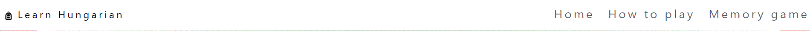
* There is a description of the game, and how to play it. 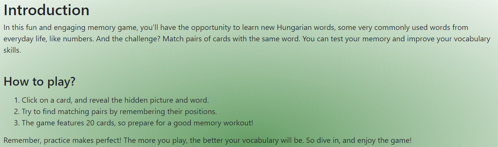
* There is a card element on the home page to go to the game. 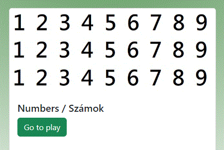
* There is a footer with my name and the year when it was created. 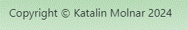
* There is a progress bar to see, how many matches the player found. 
* There is a start game button. 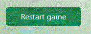
* There is a card game area, where the player can flip cards and find matching ones. 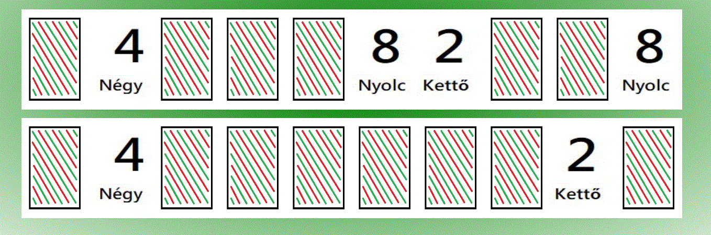
## 4. Future features
I would like to add other features to this website in the future, like other categories, songs, and stories as well, which help to learn Hungarian. Maybe some grammar exercises to practice, but in a playful version. 

## 5. Typography and color scheme
* I used the 'Roboto' font family from [Google Fonts](https://fonts.google.com/). 
* I used different version of green(#69A069, green and #011808), red(#F0C8C8), white (#ffffff), and black (#000000) colour palette for this project. This colour palette comes from the Hungarian flag. I tried to keep good colour contrasts between the elements. 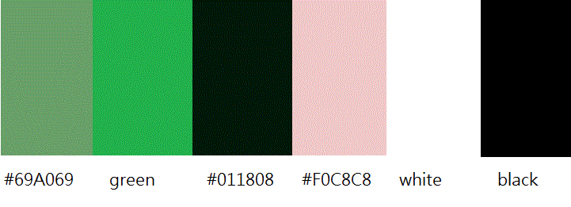
* I used images in webp format for the website, because this provides faster loading time, good quality, and improves the website's performance. (Please note, I used gif format to the README.md because it was easier to save screenshots on my computer this way).
* I used audio elements in m4a format because I recorded them with my phone.
## 6. Wireframes
I used Balsamiq to create my wireframe, which you can check here: [link to the wireframe](Language%20learning%20app.pdf). There are wireframes for 3 different screen sizes (desktop computer, tablet, phone). My project has two different websites, a home page and a game page. I modified my wireframe a couple of times; this is the latest version. This wireframe helped me to position things and organize my content.
## 7. Technologies used
* I used HTML to create the layout and the basic structure for the website.
* CSS to style the website.
* JavaScript to create a memory game.
* Bootstrap to speed up the developing process and help with accessibility and responsibility. Bootstrap and CSS media queries ensure, that the layout changes appropriately across different device screen sizes.
* I used Balsamiq for my wireframe, so I could think about the structure of my website, size the features, and see how things can work/function.
* I used git for version control.
* I used GitHub to save my repository and deploy my project online.
* I used Microsoft Paint to create and edit pictures.
* I used my phone to record audio. (Samsung Voice recorder)
* I used Microsoft Copilot and Blackbox AI to check my code and advise improvement. 
* I used converters to change the image format to .webp, such as [CloudConvert](https://cloudconvert.com/jpg-to-webp) and [FreeConvert](https://www.freeconvert.com/jpg-to-webp).
* I used [www.canva.com](https://www.canva.com/) to create mockups for different screen sizes.
## 8. Testing
### 8.1. Code validation
* I used the official W3C validator[W3C validator link](https://validator.w3.org/) for testing HTML, and there were no errors.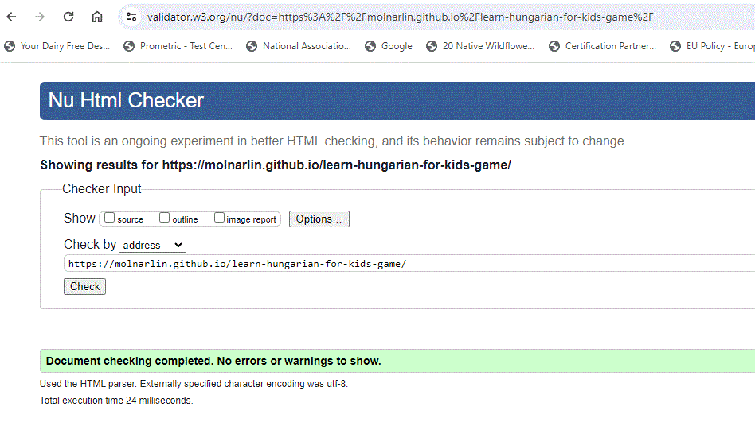
* Official (jigsaw) [CSS validator link](https://jigsaw.w3.org/css-validator/) validator for testing CSS, and my code had no errors. 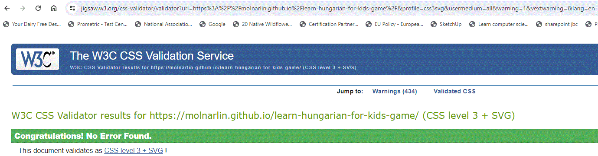
* Lighthouse report in Google Chrome. I checked the accessibility, performance, and best practices here.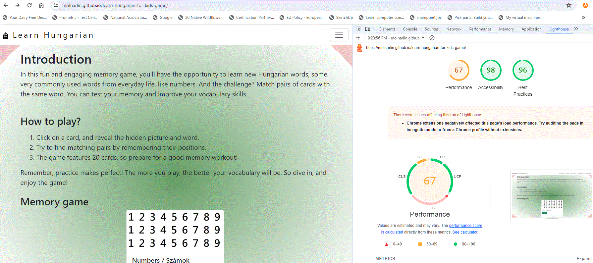
* I tested JavaScript with JSLint, there were no errors, only warnings. 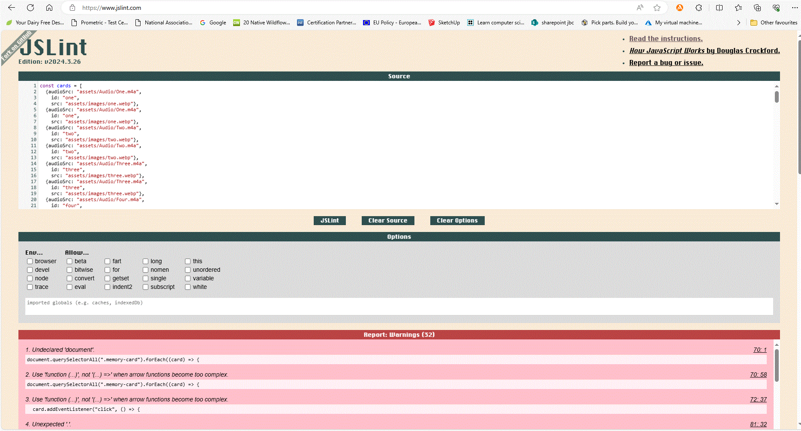
### 8.2. Test cases
#### 8.2.1.
I used Jest to test some functionalities of the game. If you want to see more, [go to the tests folder.](assets/js/tests). 
1. Testing, if the game finds [matching cards](/assets/js/tests/cardMatching.test.js).
2. Testing, if the cards are rendered.
#### 8.2.2.
Test Plan Tables
***********************************
**1. Test Plan Table for Microsoft Edge on Desktop for Home page**
**********
|Test| User requirement addressed | Expected result | Actual result | Pass / Fail | Date | Corrective Action
|--------------:|:--------------------------:|:---------------:|:-------------:|:-----------:|:----:|:-----------------
|Logo displayed| Website logo on top|Logo displayed|As expected|Pass|20/06/24|None
|Nav-bar appears|Website is easy to navigate|Nav-bar appears|As expected|Pass|20/06/24|None
|Nav-bar hyperlinks work|Website is easy to navigate|When you move the mouse over, it will become green and underlined.|As expected|Pass|20/06/24|None
|Text appears|Text is visible|Text is readable|As expected|Pass|20/06/24|None
|Card appears|Card is visible|Card appears|As expected|Pass|20/06/24|None
|Card picture renders|Picture is visible|Picture is on top of the card|As expected|Pass|20/06/24|None
|Card button appears|Website is easy to navigate|When you move the mouse over the button, it will become darker.|As expected|Pass|20/06/24|None
|Card button works|Website is easy to navigate|Button is clickable|As expected|Pass|20/06/24|None
|Footer appears|Text is visible|Text is readable|As expected|Pass|20/06/24|None
*************************************
**Test Plan Table for Microsoft Edge on Desktop for Memory game page**
****************
|Test| User requirement addressed | Expected result | Actual result | Pass / Fail | Date | Corrective Action
|--------------:|:--------------------------:|:---------------:|:-------------:|:-----------:|:----:|:-----------------
|Logo displayed| Website logo on top|Logo displayed|As expected|Pass|20/06/24|None
|Nav-bar appears|Website is easy to navigate|Nav-bar appears|As expected|Pass|20/06/24|None
|Nav-bar hyperlinks work|Website is easy to navigate|When you move the mouse over, it will become green and underlined.|As expected|Pass|20/06/24|None
|Text appears|Text is visible|Text is readable|As expected|Pass|20/06/24|None
|Progress bar appears| Progress bar is visible|Progress bar appears|As expected|Pass|20/06/24|None
|Restart game button appears|Website is easy to navigate|When you move the mouse over the button, it will become darker.|As expected|Pass|20/06/24|None
|Game cards appear|Game cards render|Game cards' back sides are visible|As expected|Pass|20/06/24|None
|Game cards flip over, when clicked|Website is easy to use|One click, and they flip over one by one|As expected|Pass|20/06/24|None
|Footer appears|Text is visible|Text is readable|As expected|Pass|20/06/24|None
************************************
**2. Test Plan Table for Google Chrome on Desktop for Home page**
**********
|Test| User requirement addressed | Expected result | Actual result | Pass / Fail | Date | Corrective Action
|--------------:|:--------------------------:|:---------------:|:-------------:|:-----------:|:----:|:-----------------
|Logo displayed| Website logo on top|Logo displayed|As expected|Pass|20/06/24|None
|Nav-bar appears|Website is easy to navigate|Nav-bar appears|As expected|Pass|20/06/24|None
|Nav-bar hyperlinks work|Website is easy to navigate|When you move the mouse over, it will become green and underlined.|As expected|Pass|20/06/24|None
|Text appears|Text is visible|Text is readable|As expected|Pass|20/06/24|None
|Card appears|Card is visible|Card appears|As expected|Pass|20/06/24|None
|Card picture renders|Picture is visible|Picture is on top of the card|As expected|Pass|20/06/24|None
|Card button appears|Website is easy to navigate|When you move the mouse over the button, it will become darker.|As expected|Pass|20/06/24|None
|Card button works|Website is easy to navigate|Button is clickable|As expected|Pass|20/06/24|None
|Footer appears|Text is visible|Text is readable|As expected|Pass|20/06/24|None
*************************************
**Test Plan Table for Google Chrome on Desktop for Memory game page**
****************
|Test| User requirement addressed | Expected result | Actual result | Pass / Fail | Date | Corrective Action
|--------------:|:--------------------------:|:---------------:|:-------------:|:-----------:|:----:|:-----------------
|Logo displayed| Website logo on top|Logo displayed|As expected|Pass|20/06/24|None
|Nav-bar appears|Website is easy to navigate|Nav-bar appears|As expected|Pass|20/06/24|None
|Nav-bar hyperlinks work|Website is easy to navigate|When you move the mouse over, it will become green and underlined.|As expected|Pass|20/06/24|None
|Text appears|Text is visible|Text is readable|As expected|Pass|20/06/24|None
|Progress bar appears| Progress bar is visible|Progress bar appears|As expected|Pass|20/06/24|None
|Restart game button appears|Website is easy to navigate|When you move the mouse over the button, it will become darker.|As expected|Pass|20/06/24|None
|Game cards appear|Game cards render|Game cards' back sides are visible|As expected|Pass|20/06/24|None
|Game cards flip over, when clicked|Website is easy to use|One click, and they flip over one by one|As expected|Pass|20/06/24|None
|Footer appears|Text is visible|Text is readable|As expected|Pass|20/06/24|None
************************************
**3. Test Plan Table for Google Chrome on Chromebook for Home page**
**********
|Test| User requirement addressed | Expected result | Actual result | Pass / Fail | Date | Corrective Action
|--------------:|:--------------------------:|:---------------:|:-------------:|:-----------:|:----:|:-----------------
|Logo displayed| Website logo on top|Logo displayed|As expected|Pass|20/06/24|None
|Nav-bar appears|Website is easy to navigate|Nav-bar appears|As expected|Pass|20/06/24|None
|Nav-bar hyperlinks work|Website is easy to navigate|When you move the mouse over, it will become green and underlined.|As expected|Pass|20/06/24|None
|Text appears|Text is visible|Text is readable|As expected|Pass|20/06/24|None
|Card appears|Card is visible|Card appears|As expected|Pass|20/06/24|None
|Card picture renders|Picture is visible|Picture is on top of the card|As expected|Pass|20/06/24|None
|Card button appears|Website is easy to navigate|When you move the mouse over the button, it will become darker.|As expected|Pass|20/06/24|None
|Card button works|Website is easy to navigate|Button is clickable|As expected|Pass|20/06/24|None
|Footer appears|Text is visible|Text is readable|As expected|Pass|20/06/24|None
*************************************
**Test Plan Table for Google Chrome on Chromebook for Memory game page**
****************
|Test| User requirement addressed | Expected result | Actual result | Pass / Fail | Date | Corrective Action
|--------------:|:--------------------------:|:---------------:|:-------------:|:-----------:|:----:|:-----------------
|Logo displayed| Website logo on top|Logo displayed|As expected|Pass|20/06/24|None
|Nav-bar appears|Website is easy to navigate|Nav-bar appears|As expected|Pass|20/06/24|None
|Nav-bar hyperlinks work|Website is easy to navigate|When you move the mouse over, it will become green and underlined.|As expected|Pass|20/06/24|None
|Text appears|Text is visible|Text is readable|As expected|Pass|20/06/24|None
|Progress bar appears| Progress bar is visible|Progress bar appears|As expected|Pass|20/06/24|None
|Restart game button appears|Website is easy to navigate|When you move the mouse over the button, it will become darker.|As expected|Pass|20/06/24|None
|Game cards appear|Game cards render|Game cards' back sides are visible|As expected|Pass|20/06/24|None
|Game cards flip over, when clicked|Website is easy to use|One click, and they flip over one by one|As expected|Pass|20/06/24|None
|Footer appears|Text is visible|Text is readable|As expected|Pass|20/06/24|None
************************************
**4. Test Plan Table for Google Chrome on Samsung Galaxy phone for Home page**
**********
|Test| User requirement addressed | Expected result | Actual result | Pass / Fail | Date | Corrective Action
|--------------:|:--------------------------:|:---------------:|:-------------:|:-----------:|:----:|:-----------------
|Logo displayed| Website logo on top|Logo displayed|As expected|Pass|20/06/24|None
|Nav-bar appears|Website is easy to navigate|Nav-bar appears|As expected|Pass|20/06/24|None
|Nav-bar hyperlinks work|Website is easy to navigate|When clicked, it will become green and underlined.|As expected|Pass|20/06/24|None
|Text appears|Text is visible|Text is readable|As expected|Pass|20/06/24|None
|Card appears|Card is visible|Card appears|As expected|Pass|20/06/24|None
|Card picture renders|Picture is visible|Picture is on top of the card|As expected|Pass|20/06/24|None
|Card button appears|Website is easy to navigate|When clicked, it will become darker.|As expected|Pass|20/06/24|None
|Card button works|Website is easy to navigate|Button is clickable|As expected|Pass|20/06/24|None
|Footer appears|Text is visible|Text is readable|As expected|Pass|20/06/24|None
*************************************
**Test Plan Table for Google Chrome on Samsung Galaxy phone for Memory game page**
****************
|Test| User requirement addressed | Expected result | Actual result | Pass / Fail | Date | Corrective Action
|--------------:|:--------------------------:|:---------------:|:-------------:|:-----------:|:----:|:-----------------
|Logo displayed| Website logo on top|Logo displayed|As expected|Pass|20/06/24|None
|Nav-bar appears|Website is easy to navigate|Nav-bar appears|As expected|Pass|20/06/24|None
|Nav-bar hyperlinks work|Website is easy to navigate|When clicked, it will become green and underlined.|As expected|Pass|20/06/24|None
|Text appears|Text is visible|Text is readable|As expected|Pass|20/06/24|None
|Progress bar appears| Progress bar is visible|Progress bar appears|As expected|Pass|20/06/24|None
|Restart game button appears|Website is easy to navigate|When clicked, it will become darker.|As expected|Pass|20/06/24|None
|Game cards appear|Game cards render|Game cards' back sides are visible|As expected|Pass|20/06/24|None
|Game cards flip over, when clicked|Website is easy to use|One click, and they flip over one by one|As expected|Pass|20/06/24|None
|Footer appears|Text is visible|Text is readable|As expected|Pass|20/06/24|None
************************************
### 8.3. Fixed bugs
I came across a couple of bugs and I briefly explained how I fixed them here.
* I used Bootstrap for this game and its grid system, I added classes to the .html file, so any layout changes were done here. In the example below first, I used class="container-fluid", which fills the available width, but the game card layout did not work out well, so I changed to class="container".
```
<div class="memory-game d-flex container">
        <div class="row" id="card-container">
        </div>
      </div>
```
* There was a problem when I double-clicked the cards, they flipped back. So I added a global flag to the flipped card and started with the value false, when they were flipped, the value was true. Later on, this was changed, and only those cards were flipped, whose value was false.
```
// Add a global flag to track whether a card is being flipped or not
let isFlipping = false;
// Add a flag to each card to track its flipped state
document.querySelectorAll(".memory-card").forEach((card) => {
  card.flipped = false;
  card.addEventListener("click", () => {
    // If a card is being flipped, don't flip another card
    if (isFlipping) {
      // do nothing
      return;
    }
    flipCard(card);
  });
});
```
```
 if (card.flipped) { /* card is already flipped, exit */ return; }
    isFlipping = true;
```

### 8.4. Supported screens and browsers
## 9. Deployment
### 9.1. via VS Code
1. I had some problem with VS Code to deploy my code locally, so I cloned my repository to my computer.
2. I opened the index.html and categories.html from my computer's File Explorer. 
### 9.2. via GitHub Pages
1. I connected Visual Studio Code with my GitHub account.
2. I committed and pushed all of my new code regularly to GitHub.
3. Inside this repository I went to Settings > Pages and it was deployed from the main branch.
4. When my site was live, I could visit it from here.
## 10. Credits
* I must say a big thank you to Runshaw College and Code Institute for guiding me and helping me with this project.
* For inspiration I used [JavaScript Academy](https://www.youtube.com/watch?v=xWdkt6KSirw), and [MemoryGameJS on GitHub](https://github.com/IamPrime/MemoryGameJs).
