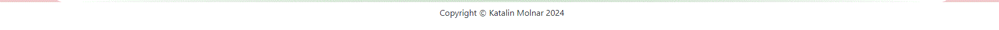
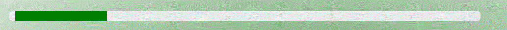
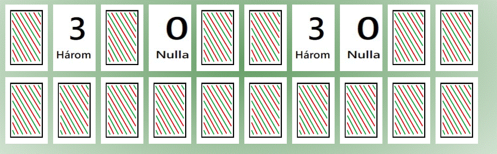

# Milestone project 2
This is a milestone project 2 for Code Institute and Runshaw College.
## 1. Purpose of the project
I wanted to make a language-teaching game for children, and I had some criteria for that:
1. It has to be engaging and fun.
2. It has to teach some basic Hungarian words.
3. It has to be easy to use.
4. It has to be a short game or a collection of short games. 
### 1.1. Developer and business goals
## 2. User stories
As a visitor, I want to learn a bit of Hungarian and play fun games simultaneously. I would like to easily find everything on the webpage. I would like to see, what is the game about, and how to play it. I would like to see my progress, and I would like to restart the game at any moment. 
## 3. Features
### 3.1. Existing features
* There is an easy-to-use navigation bar at the top of the websites. 
* There is a description of the game, and how to play it. 
* There is a card element on the home page to go to the game. 
* There is a footer with my name and the year when it was created. 
* There is a progress bar to see, how many matches the player found. 
* There is a restart button, if someone wants to restart the game. 
* There is a card game area, where the player can flip cards and find matching ones. 
## 4. Future features
I would like to add other features to this website in the future, like other categories, songs, and stories as well, which help to learn Hungarian. Maybe some grammar exercises to practice, but in a playful version. 

## 5. Typography and color scheme
* I used Roboto font family from [Google Fonts](https://fonts.google.com/). 
* I used different version of green(rgb(105, 160, 105), green and #011808), red(rgb(240, 200, 200)), white (#ffffff), and black (#000000) colour palette for this project. This colour combination comes from the Hungarian flag. I tried to keep good colour contrasts between the elements.
* I used images in webp format for the website, because this provides faster loading time, good quality, and improves the website's performance. (Please note, I used gif format to the README.md because it was easier to save screenshots on my computer this way).
* I used audio elements in m4a format because I recorded with my phone.
## 6. Wireframes
I used Balsamiq to create my wireframe, which you can check here [Link to the wireframe](Language%20learning%20app.pdf). There are wireframes for 3 different screen sizes (desktop computer, tablet, phone), and a tree structure to understand, how users can navigate between the different game categories. My project has two different websites and many different games. I modified my wireframe a couple of times; this is the latest version. This wireframe helped me to position things and organize my content.
## 7. Technologies used
* I used HTML to create the layout and the basic structure for the website.
* CSS to style the website.
* JavaScript to create a memory game.
* Bootstrap to speed up the developing process and help with accessibility and responsibility. Bootstrap and CSS media queries ensure, that the layout changes appropriately across different device screen sizes.
* I used Balsamiq for my wireframe, so I could think about the structure of my website, size the features, and see how things can work/function.
* I used git for version control.
* I used GitHub to save my repository and deploy my project online.
* I used Microsoft Paint to create and edit pictures.
* I used my phone to record audio. (Samsung Voice recorder)
* I used Microsoft Copilot and Blackbox AI to check my code and advise improvement. 
* I used converters to change the image format to .webp, such as [CloudConvert](https://cloudconvert.com/jpg-to-webp) and [FreeConvert](https://www.freeconvert.com/jpg-to-webp).
## 8. Testing
### 8.1. Code validation
* I used the official W3C validator[W3C validator link](https://validator.w3.org/) for testing HTML, and there were no errors.
* Official (jigsaw) [CSS validator link](https://jigsaw.w3.org/css-validator/)validator for testing CSS, and my code had no errors. 
* Lighthouse report in Google Chrome. I checked the accessibility, performance, and best practices here.
### 8.2. Test cases
I used Jest to test some functionalities of the game. If you want to see more, [go to the tests folder.](assets/js/tests). 
1. Testing, if the game finds [matching cards](/assets/js/tests/cardMatching.test.js).
### 8.3. Fixed bugs
I came across a couple of bugs, and I briefly explained how I fixed them here.
* I used Bootstrap for this game, and for the grid system, I added classes to the .html file, so any changes in layout were done here. In the example below first, I used class="container-fluid", which fills the available width, but the game card layout didn't work out well, so I changed to class="container".
```
<div class="memory-game d-flex container">
        <div class="row" id="card-container">
        </div>
      </div>
```
* For the resetGame function I added this code for the first time:
```
      const cards = document.querySelectorAll('.memory-card');
    
      cards.forEach((card) => {
        const frontFace = card.querySelector('.front-face');
        const backFace = card.querySelector('.back-face');
        frontFace.classList.add('d-none');
        frontFace.classList.remove('d-block');
        backFace.classList.remove('d-none');
        backFace.classList.add('d-block');
    });
    
    //Reset the 'flippedCards' and 'matchedCards' arrays
    flippedCards =[];
    matchedCards =[];
```
But the cards stayed the same place, so I had to add a shuffleCards function, which was very similar, to how I created the shuffledCard array at the beginning.
### 8.4. Supported screens and browsers
## 9. Deployment
### 9.1. via VS Code
1. I had some problem with VS Code to deploy my code locally, so I cloned my repository to my computer.
2. I opened the index.html and categories.html from my computer's File Explorer. 
### 9.2. via GitHub Pages
1. I connected Visual Studio Code with my GitHub account.
2. I committed and pushed all of my new code regularly to GitHub.
3. Inside this repository I went to Settings > Pages, and I deployed from the main branch.
4. When my site was live, I could visit it from here.
## 10. Credits
* I have to say a big thank you to Runshaw College and Code Institute for guiding me and helping me with this project.
* For inspiration I used [JavaScript Academy](https://www.youtube.com/watch?v=xWdkt6KSirw), and [MemoryGameJS on GitHub](https://github.com/IamPrime/MemoryGameJs).
